# Rails Routing and Resources

## Learning Objectives (5 min)

* Review the relationship between HTTP requests and Controller actions.
* Identify the role a router (`routes.rb`) plays in the Rails MVC model.
* Use resources to define routes for a RESTful controller.
* Use `rails routes` to display RESTful routes.
* Implement route names in Rails link helpers.
* Implement nested routes in a Rails application.
* Describe how path helpers work for nested routes.
* Implement `form_for` to build a form for a nested resource.

## The Router (5 min)

It's our good ol' friend the Rails rMVC diagram!


<details>
<summary>Q: Who can walk us through the rMVC pattern, highlighting where the router is and what it does?</summary>

> The router matches an HTTP request to a controller and action.
* The gateway to the rMVC (router / model / view / controller).
* So something like this `get "/artists/2"` is directed to the `artists` controller `show` action.
* Returns an error if the HTTP request is unrecognizable and/or does not match a controller action.

</details>

---

## Routes (10 min)

Clone the [tunr_rails_routes_resources repo](https://github.com/ga-wdi-exercises/tunr_rails_routes_resources).  This provides starter code for this lesson. This repo also contains a solution branch containing all the code we'll be executing today.

In our Intro to MVC class we explored the role of `config/routes.rb` file in a
Rails application. In this file we define all the known routes of our application,
and then map those routes to their appropriate controller actions.

<details>
<summary>**Q**. What does the individual route to the `index` page for `artists` look like?</summary>

```rb
# index
get "/artists", to: "artists#index"
```

</details>

<details>
<summary>**Q**. And the `show` page for an `artist`?</summary>

```rb
# show
get "/artists/:id", to: "artists#show"
```

</details>


<details>
<summary>**Q**. At a high level, what happens when we visit `http://localhost:3000/`?  Why?</summary>

> A. We see a listing of Artists.

> Why? A "root" route is defined.  When we visit http://localhost:3000/, we trigger the index action in our Artists controller.

```rb
root to: "artists#index"
```

</details>

## What Routes? (10 min)

Q: How do we find out what routes our app handles requests for?
---

Rails docs are awesome!  Familiarize yourself with the methods for listing a Rails application's routes:

http://guides.rubyonrails.org/routing.html#inspecting-and-testing-routes

> To get a complete list of the available routes in your application, visit http://localhost:3000/rails/info/routes in your browser while your server is running in the **development** environment. You can also execute the `rails routes` command in your terminal.

Here's some simplified output.  We've removed some data to focus on the HTTP Verb, the URI Pattern, and the Controller Action.
Note the "root" route and the duplication.  A combination of HTTP Verb (or Method) and URI (or Path) are required to identify a specific Controller Action.

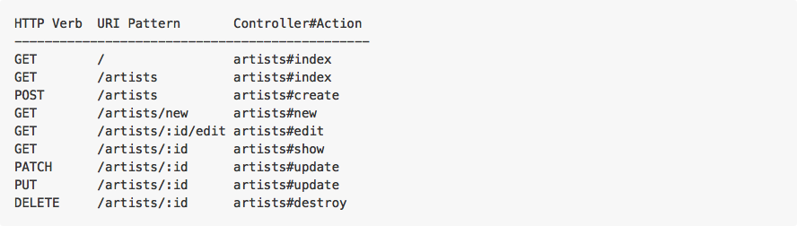

### `rails routes`

* Open up your terminal and, in the same folder as your application, type in `rails routes`.  You should see something like this.

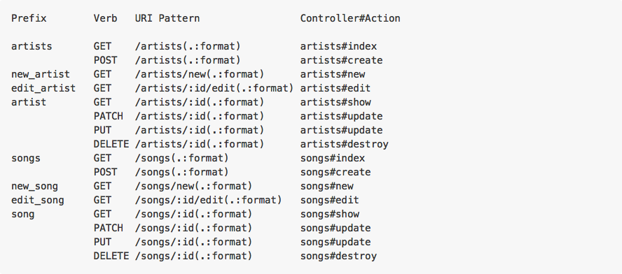

## Named Route Helpers

Looking at the output, we see the first column is "Prefix".  Rails provides helpers for referencing these routes in code.  This column provides information about the naming convention for these Named Route Helpers (aka Path Helpers).

### You Do: Research Named Route Helpers (aka Path and URL Helpers) (10 min)

Back to the docs... read about [Path Helpers](http://guides.rubyonrails.org/routing.html#path-and-url-helpers)

**Questions**:

<!-- What are helpers? -->
<details>
<summary>What are Helpers, in general, in Rails?</summary>

> **Helpers** codify Rails conventions.  They write html using Rails or, in the case of custom Helpers, our project's conventions.

</details>

<!-- What are Path Helpers? -->
<details>
<summary>How do Path Helpers fit into that category?</summary>

> **Path helpers** are methods which provide the urls (and paths) to a Resource.  We build them using the prefixes from `rails routes`.

</details>

<!-- What do Path helpers look like? -->
<details>
<summary>What do Path Helpers look like?</summary>

```
prefix + _path = Path Helper
```

</details>

---

Looking at this output from `rails routes`,

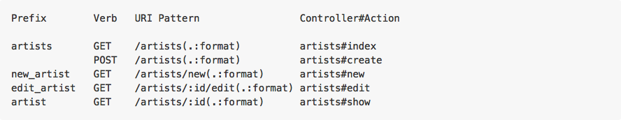

<!-- Artists Index url  -->
<details>

<summary>**Q**: What named route helper will return the url to list all `Artists`?</summary>

> A. `artists_url`

</details>

<!-- **Q**. Artist Show helper  -->
<details>

<summary>**Q**: What named route helper will return the path to show an `Artist`?</summary>

> A. `artist_path(@artist)`

> **Note**: to indicate which artist we should show, we need to pass a **reference** to an `artist`.

</details>

<!-- **Q**. Path Helpers -->
<details>

<summary>**Q**: Where do we utilize Path Helpers in Rails?</summary>

> A.  We use Path Helpers in views and controllers.

</details>


<!-- Q. Why not models? -->

<details>
<summary>**Q**. Why not in models?</summary>

> A. Models do not usually know about their place within the request/response cycle.  They are focused on the Business Rules and Persistence, not the User Interaction.

</details>

<!-- **Q**. Path Helpers & Verbs -->
<details>

<summary>**Q**: Why are there path-prefixes only for GET requests? </summary>

> A.  These path-prefixes are provided by rails to trigger a controller method which renders a view

</details>

<!-- **Q**. _Path and _Url  -->
<details>

<summary>**Q**. When do we use the `_path` helper? The `_url` helper?</summary>

> A. We use `_url` helpers when redirecting.  Use `_path` for everything else.

</details>

<!-- Why?  -->
<details>

<summary>**Q**. Why?</summary>

> A. The web expects it.  https://www.viget.com/articles/rails-named-routes-path-vs-url

</details>

> related: [Link Helpers](http://mixandgo.com/blog/how-to-use-link_to-in-rails)

### Review Routes

http://guides.rubyonrails.org/routing.html#generating-paths-and-urls-from-code

<details>
<summary>**Q**. What can you expect the `params` hash to look like after we go to the url `/artists/9` in our browser?</summary>

```rb
# params
{  id: "9",
  controller: "artists",
  action: "show"
}
```

</details>

**ProTip**: `params` values are always strings.  ActiveRecord methods (e.g. #find), will convert it to an integer.  This means you can use this in your url `/artists/1-YeahYeahYeahs`.


## RESTful Routes (5 min)

REST attempts to view everything on the web as a Resource. RESTful resources are expected to be managed via specific routes.  Rails makes it easy to generate RESTful routes, via `resources`.

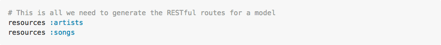

These lines:

* Explicitly tells Rails that we will be using RESTful routes.
* Generates path helpers.
* `resources` creates routes using a combination of REST and Rails conventions.  It assumes properly named controllers -- in this case, `artists_controller.rb` and `songs_controller.rb` -- and actions.

Let's review the output of `rails routes`.

## Nested Resources (15 min)

The way our app is currently routed is fine. `Songs` and `Artists` have their very own resources and doesn't depend on the other. We can, however, change our domain a bit.  We can make `Songs` depend on their `Artist`. We indicate, and control this, by nesting our resources. We want to be able to visit urls like this:

`http://www.tu.nr/artists/3/songs/12`

* Currently we can visit an `artist` `show` page, which includes a link of all that `artist`'s `songs`.

**Q**. What would it mean to have a URL like that? Why do we do it this way?
---

> A.
  * It concisely reflects our data structure: all `songs` are dependent on an `artist`.
  * Also allows users to access specific information using the URL.

Ultimately, we want to structure our routes so that all `Songs` exist only within the context of an `Artist`.

> The reasons might not be so apparent for routes like `show`, `edit`, `update` and `destroy` because we have access to a `song` ID in the url anyway. But by using nested resources, it's easier to create a `song` because we have the `artists` id in the url. Or maybe we want the `songs` index route to be namespaced under an `artist`. We can **ensure** that a `Song` is associated with a specific `Artist`.

> This brings us to another side note. Ultimately your domain model is just that, yours. It's up to you to decide whats the right fit. Which tables make the most sense for the problems that I face in my application. Which associations should I use to best facilitate querying my database. Which resources should I have and under which namespaces? These are the questions developers ask themselves each and every time a new application is being created. We're just here to teach you some tools to answer these questions for yourself.

So our ideal `Song` `index` will look something like this...


And our `show` route will look something like this...

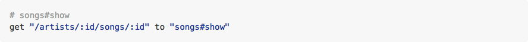

**Q**. Given this route `artists/7/songs/14`, what do you think would be in the `params` hash for this route?
---

> `params = { id:}`
> Um, `:id` is used twice. How do we know which is which?

Exactly!  We need to reference our `Artist` ID separate from our `Song` ID.  Our routes need to look something more like this...

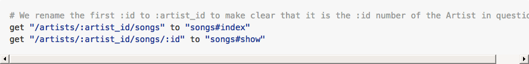

## BREAK (10 min)

Updates to "config/routes.rb"

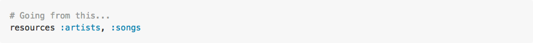

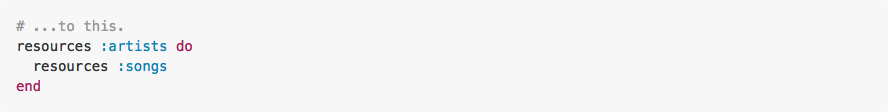


## Let's implement nested routes in Tunr! (60 min)

Okay, so our `routes.rb` file is updated with nested resources. Let's see them in action and fire up our Tunr app!

### Uh oh. It broke...


That's okay. You're going to spend the next hour fixing it!

### TPS: What do we need to change? (3/2, 5 min)

* Look through your application and think about what we need to change in order to accommodate our new routing system.
* Don't worry about solving the problem immediately. Start by identifying files we need to change.

### Let's look at `rails routes` again...

**Q**. Has anything changed?
---

* Our HTTP requests (URI Pattern) match the individual nested routes we just talked about (e.g., `:artist_id`).
* Our Song path helpers are now prefixed with artist (e.g., `artist_songs`, `new_artist_song`).
* Our controller actions are the same.

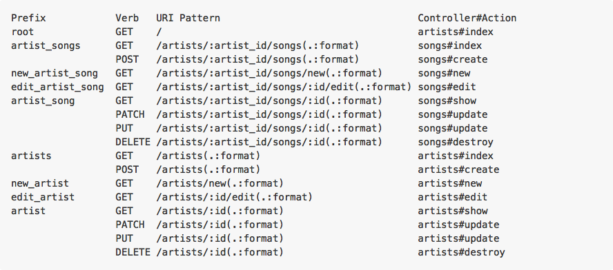


**Q**. Are we going to need to change anything in our app?
---

Having seen this, let's make a To-Do list of things to change in our Rails app so that we can successfully use nested resources.  
  1. Link Helpers  
  2. Form Helpers  
  3. Songs Controller  

## YOU DO: Fix the app!

For the rest of the class we'll be working to fix the app.  Feel free to follow along, or go at your own pace.

#### Bonuses

If you find yourself moving along faster than my pace, try implementing the following...
* A third model for `Genre` that has a `belongs_to` relationship with `Artists`.
* There are also some advanced topics included in "Additional Reading" at the bottom of the lesson plan.

### Let's take another look at that error...


**Q**. How do we fix this?
---

> A. **DELETE IT**.
* The original link took us to a list of all the songs in our application.
* While getting rid of it may be a bad move from a usability standpoint, by implementing nested resources we made the decision that songs will never exist independent from an artist.

### Let's click on an artist...

Another error! What went wrong this time?


Our app does not like the `new_song_path` we used in a link helper in our `artists/show.html.erb` file.

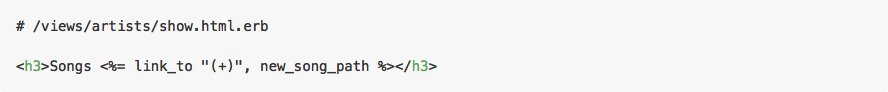


What do we need to replace this path helper with?
* **HINT:** Look at `rails routes`!

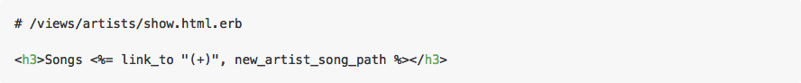

By nesting resources, `new_song_path` became `new_artist_song_path` since every `song` we create is now created in the context of an `artist`.
* But our app is still giving us an error. WHY?!


You'll notice that we're getting a different error this time that ends with: `missing required keys: [:artist_id]`

**Q**. What else we have to do to our link helper to fix this?
---

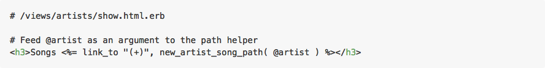


We need to feed our `new_artist_song_path` helper an `artist` as a **variable**. Now our app knows which `artist` it is rendering a new `song` form for.  

And that'll do it. Let's refresh our page...


So now what? The link helper for an individual song inside of our .each enumerator isn't working.

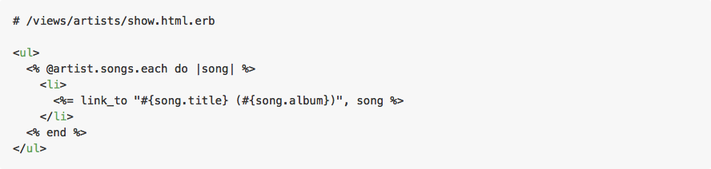

Some thoughts:
* We don't have a path helper in the above example. What page are we trying to link to?
* So which path helper do we need to add?
* Do we need to feed it a variable? If so, how many?

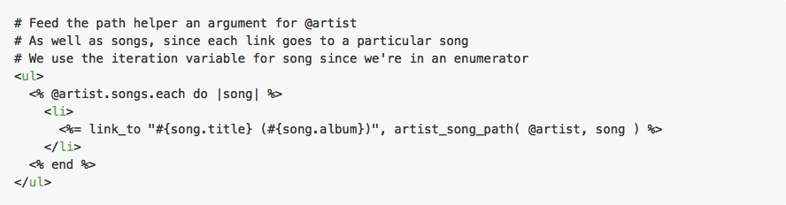

From an `artist` `show` page, click on a `song`. You should get an error.
* Try fixing the `songs/show.html.erb` file.
* **HINT:** You might have to add an instance variable to `songs_controller.rb`.
  * Remember, our `song` routes doesn't look the same as they did before!

### Form Helpers

Something else we'll need to change are forms. Let's try making a new `song`.
* From an `artist` `show` page, click on the "(+)" next to "Songs".

No immediate error! But it's not working quite yet. Let's try creating a `song`.


Looks like our form is trying to access a `/songs` route.
* Our application does not support that particular route.
* Let's take a look at `songs/new.html.erb` and `songs_controller.rb` and see how we can fix this...

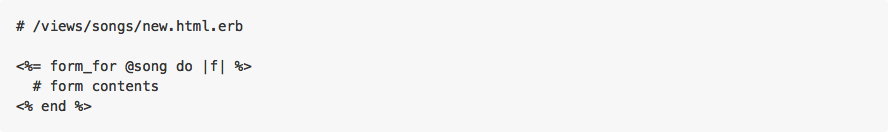

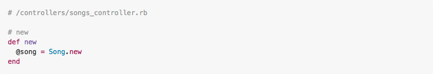

We need to associate each new song with an artist. To do that, we need to provide our `form_for` helpers with **both** an `artist` and `song` as arguments.
* That means we first need to define the `artist` in question in our controller action. Then we can modify our form.

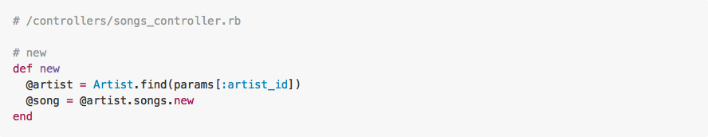

Now let's modify our form.
* When feeding multiple arguments to `form_for`, we have to place them inside of an array.
* In this case, we're not only giving it a new `song` (via `@song`) but also the `artist` we'll be adding it to (via `@artist`).
* We can also take out the field for `artist_id` since we should be auto-populating that with our associations

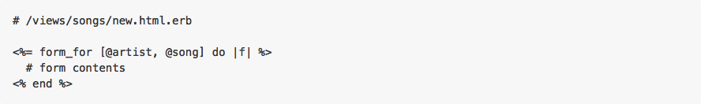

That takes care of the form. Now we need to fix the `create` controller action in `songs_controller.rb` so that we can add `songs` to `artists`!
  * We need an `artist` to add a `song` to, right? How do we set that up.
  * How should we modify `@song` so that it's saved to the proper `artist`?
  * Where would it make most sense to redirect to? Let's try the `artist` `show` page -- what path should we use?

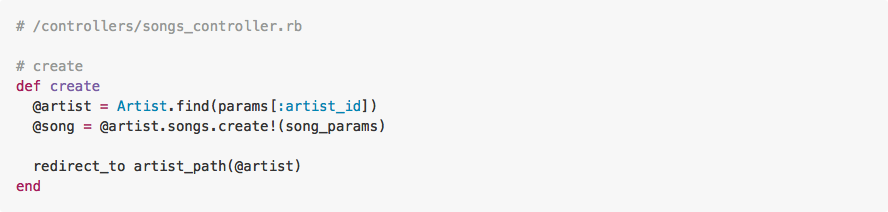

Now you do the rest! Debug the following pages/forms so that they don't generate any errors upon loading/submission.
* `/views/artists`
  * `edit.html.erb`
  * `index.html.erb`
  * `new.html.erb`
* `/views/songs`
  * `edit.html.erb`
  * `index.html.erb`
  * `show.html.erb`

It seems pretty daunting, but you won't have to change anything beyond link helpers, form helpers and controller actions.
* If you feel lost, follow the error.
* Don't worry if you don't get to all of them.
* Strongly encourage you to work with each other on this.
* The instructors are also here to help.

## BREAK (10 min)

## Additional (Optional) Reading
* [Rails Routing From The Outside In](http://guides.rubyonrails.org/routing.html)
* [The Lowdown On Routes](https://blog.engineyard.com/2010/the-lowdown-on-routes-in-rails-3)
* [Scoping Rails Routes](http://notahat.com/2014/02/05/scoping-rails-routes.html)

Spend the remaining class-time either working on your homework or ask us questions on anything you've learned this week.

## Conclusion

- List the routes provided using the `resources :person` method and the associated action for each
- Why would we nest resource routes?
- How can we see the routes our app supports?
